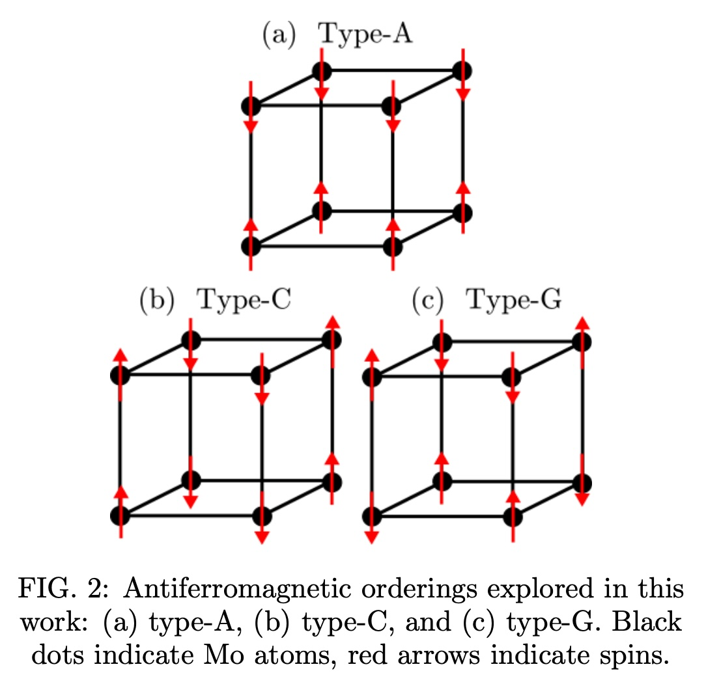

# Visualize octahedral antiferromagnetic orderings

Figure from:
Lee-Hand, J.; Hampel, A.; Dreyer, C. E. First-Principles Study of the Electronic, Magnetic, and Crystal Structure of Perovskite Molybdates. Phys. Rev. Materials 2021, 5 (8), 085001. https://doi.org/10.1103/PhysRevMaterials.5.085001.
